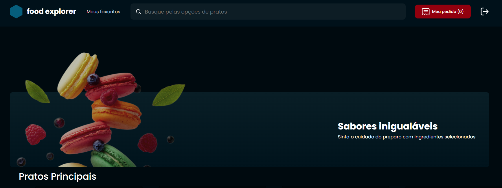
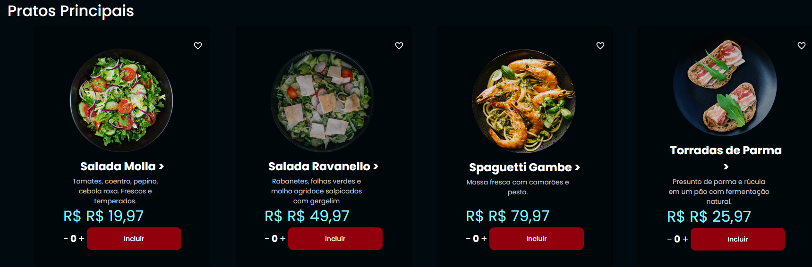
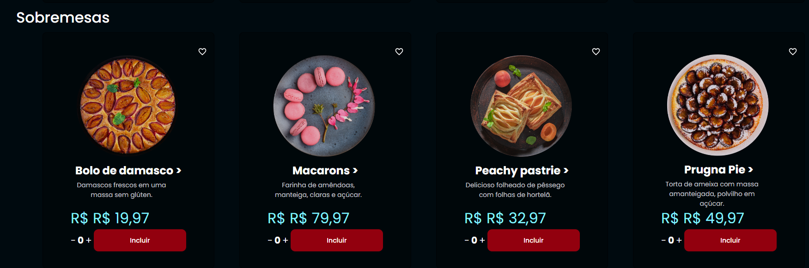
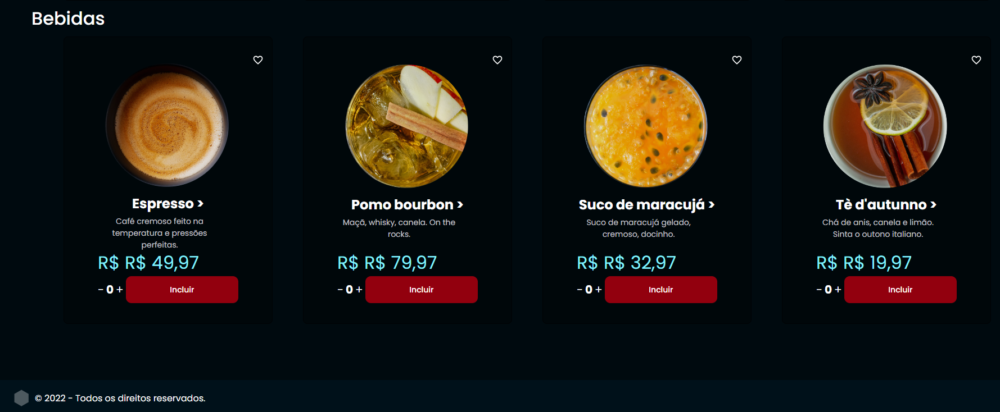

<h1 align="center" > Food Explorer </h1>

<p align="center"> Projeto final do Explorer, curso da Rocketseat </p>


## 💻 SOBRE:

Neste desafio foram abordados os seguintes temas:

- React;
- Routes;
- components;
- Props;
- hooks;
- context;

## 🎨 LAYOUT

O layout da aplicação está disponível no <a href="https://www.figma.com/file/GkqG5AUJe3ppcUEHfvOX6z/food-explorer?node-id=0%3A1">Figma</a>

## 🎨 LAYOUT FINAL






## 🚀 COMO EXECUTAR O PROJETO

Este projeto é divido em duas partes:
1. Backend
2. Frontend 

💡 O Backend deve estar rodando em sua máquina para que o frontend seja reenderizado!!

### 🎲 RODANDO O BACKEND

```bash
# Clone este repositório
$ git clone https://github.com/VitoriaCaminha/Frontend-Food-Explorer.git

# Instale as dependências
$ npm install

# Execute as migration e seed
$ npm run migrate
$ npm run seed

# Execute a aplicação em modo de desenvolvimento
$ npm run dev

# Login do admin
$ email: admin@email.com
$ password: admin1

# O servidor inciará na porta:3333 - acesse <http://localhost:3333>
```


#### 🎲 RODANDO O FRONTEND

```bash

# Clone este repositório
$ https://github.com/VitoriaCaminha/Frontend-Food-Explorer.git

# Instale as dependências com:
$ npm install

# Rode a aplicação em modo de desenvolvimento:
$ npm run dev

# O servidor inciará na porta:3333 - acesse <http://localhost:5173/>
```

## 🛠 TECNOLOGIAS

Este projeto foi desenvolvido com as seguintes tecnologias:

- HTML
- CSS
- Node.js
- React.js

## DEPLOY DO PROJETO

https://frontend-food-explorer-ruby.vercel.app/